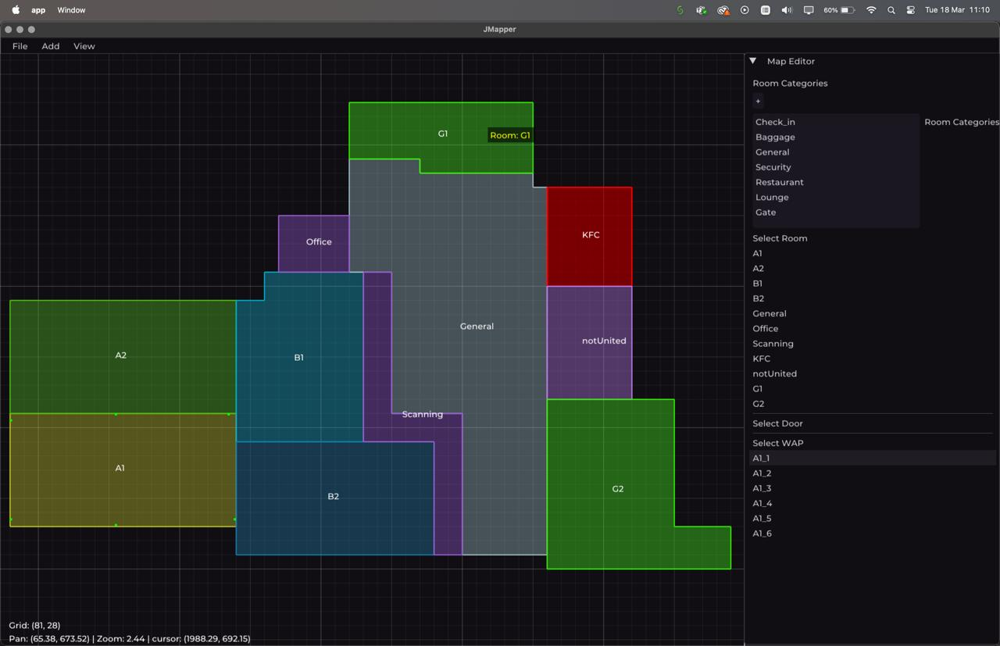

# JMapper - Room Mapping Software for the Prose System

<p align="center">
  
</p>


A C++ desktop application built with **Dear ImGui** for creating floor plans, managing wireless access points (WAPs), and exporting maps to the `.PRZMAP` format compatible with the **Prose** web application system.

## Features
- **Room Mapping**: Draw and resize arbitrarily shaped rooms with the intuitive pen tool
- **Custom Colors**: Assign colors to rooms
- **WAP Management**: Place and label Wireless Access Points (WAPs) within rooms
- **Door Placement**: Add doors between adjacent rooms
- **Prose System Integration**: Export maps to `.PRZMAP` format for web application parsing
- **ImGui Interface**: User-friendly graphical interface with real-time preview
- **Cross-Platform**: Uses GLFW and TinyFileDialogs to allow a platform-independent experience

## Installation
### Dependencies
- C++17 compiler
- [Dear ImGui](https://github.com/ocornut/imgui) (v1.89+)
- GLFW/OpenGL backend

### Build Instructions
```bash
git clone https://github.com/yourusername/roommapper.git
cd roommapper
mkdir build && cd build
cmake ..
make
